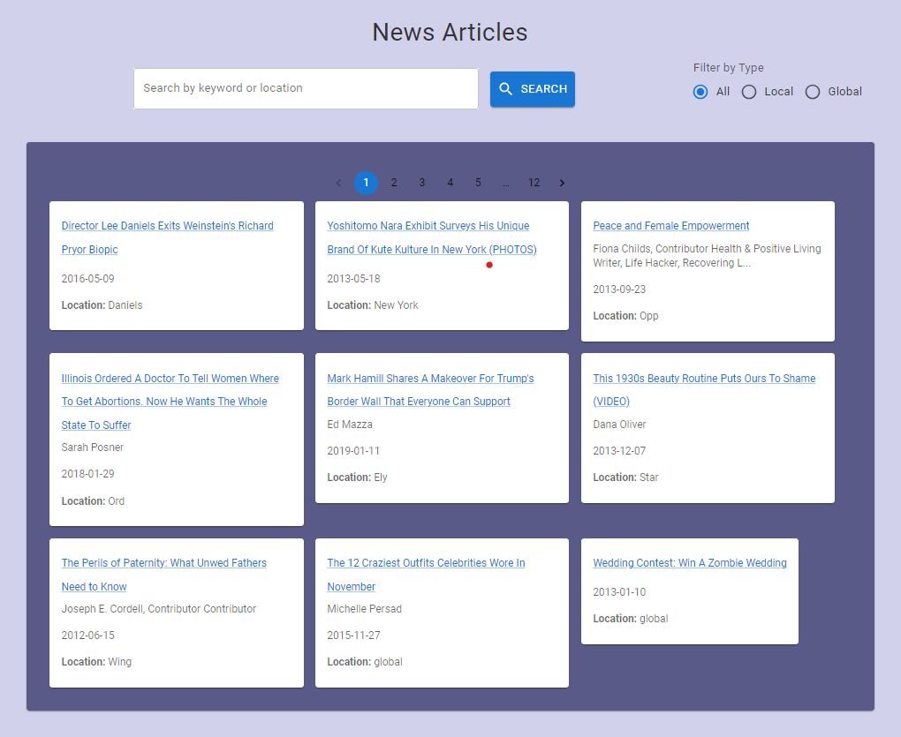

# **Local News Experience for US Cities**

## **Overview**

This project delivers a **local news experience** for cities in the United States. The system processes news articles, classifies them as either "local" or "global," determines the location for the local news, and allows users to search and filter articles based on their location. The project is built using:

- **React** for the frontend
- **Node.js** for the backend
- **MongoDB** for the database
- **Docker** for containerization
- **AWS** for deployment

---

## **Key Features**:

- **News Classification**: Articles are classified as either "local" or "global" based on their content.
- **City-based Filtering**: Users can filter news by their city or search for articles related to specific cities.
- **Pagination**: Supports pagination for viewing a large number of articles.
- **Responsive UI**: Built with **Material UI** to provide a smooth user experience.
- **Dockerized**: The application is fully containerized using Docker for easy deployment and scaling.
- **Deployment on AWS**: The app is hosted on **AWS** for easy access.

---

## **Datasets**

### **US Cities Dataset**:

This dataset contains the names of cities in the United States. It is used to classify articles based on location. The dataset is stored as a **CSV file** (`uscities.csv`), which is processed to generate a list of unique city names (`unique_city_names.json`).

### **News Articles Dataset**:

The dataset contains a collection of news articles, some of which are local to specific cities and others are global. The articles are used to demonstrate the classification system.

---

## **Data Pipeline**

The data pipeline includes the following steps:

1. **Step 1: Download US Cities Dataset**  
   Download the `uscities.csv` dataset, which contains information about all cities in the United States.

   LINK: `https://www.kaggle.com/datasets/sergejnuss/united-states-cities-database`

2. **Step 1: Download US News Dataset**  
   Download the `News_Category_Dataset_v3.json` dataset, which contains contains around 210k news headlines from 2012 to 2022 from HuffPost.

   LINK: `https://www.kaggle.com/datasets/rmisra/news-category-dataset`

3. **Step 2: Run the Scripts**

   - **extract.js**:  
     This script extracts the unique city names from the `uscities.csv` dataset and generates a `unique_city_names.json` file containing a list of all cities.

   - **assignCity.js**:  
     This script assigns a city name to each article based on whether the article's header or description contains a city from the list. Articles that do not contain a city name are labeled as "global". The output is stored in an `updated_dataset.json` file.

   - **analyse.js**:  
     This script analyzes the dataset to determine how many articles belong to a city and how many are labeled as "global". It also calculates the percentage of "global" articles in the dataset.

   - **balance.js**:  
     This script balances the dataset by ensuring that approximately 20% of the articles are labeled as "global", it also puts the total number of articles to 100, just to simplify. The balanced dataset is stored in `balanced_dataset.json`.

4. **Step 3: Integrate OpenAI for Classification**  
   The `dataPipeline.js` script integrates **OpenAI's GPT-4o-mini model** for classifying articles as either "local" or "global". The model also determines the city associated with local articles. The prompt is prepared for OpenAI to classify each article based on the content, and the API is called to process the articles.

---

## **Backend**

The backend is built with **Node.js** and provides an API for searching and filtering news articles based on location. It uses **MongoDB** for data storage.

### **Backend Features**:

- **MongoDB Integration**: MongoDB stores the articles and their locations.
- **News Classification**: The backend classifies articles as "local" or "global" based on the data pipeline.
- **Search API**: Allows users to search for articles by location.
- **Filter API**: Filters articles by city and "local"/"global" categories.

---

## **Frontend**

The frontend is built with **React** and **Material UI**. It provides a user interface to search and view news articles based on location.

### **Frontend Features**:

- **Search Bar**: Allows users to search for articles by city.
- **Filter**: Filters articles by city and type ("local" or "global").
- **Pagination**: Supports paginated results for displaying large sets of articles.
- **Responsive Design**: Built with **Material UI** to ensure a good experience across different devices.

---

## **Docker Setup**

The project is containerized using Docker. There are separate **Dockerfiles** for the frontend and backend, and a `docker-compose.yml` file is used to manage the containers.

---

## **Deployment on AWS**

The application is hosted on **AWS** for easy access. After building and testing the app locally with Docker, the Docker containers was deployed to an EC2 instance.

---

## **Conclusion**

This project demonstrates the use of a data pipeline to classify news articles as "local" or "global" and assign them to cities in the United States. The solution is fully Dockerized, supports frontend and backend communication, and is deployed on AWS for easy access.
